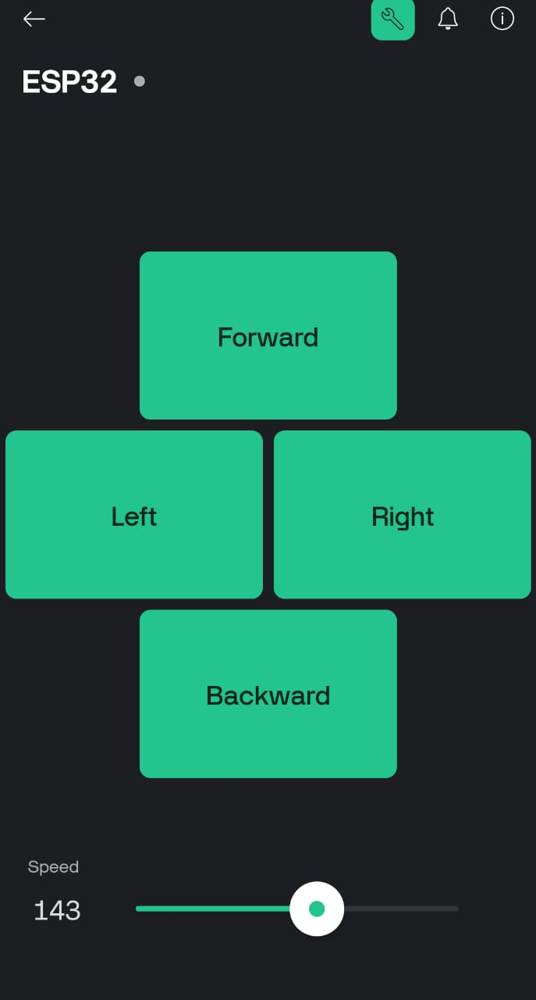

# ESP32 Robot Controlled with Blynk IoT App

This project allows you to control an ESP32-powered robot using the **Blynk IoT mobile app**. The robot can move **forward**, **backward**, **left**, and **right** through four buttons on the app.

## 🧰 Features

* Remote control of robot directions
* PWM speed control for motors
* Blynk IoT integration

---

## 📱 Blynk App Setup

### 1. Install the Blynk IoT app

* Android: [Play Store](https://play.google.com/store/apps/details?id=cloud.blynk)
* iOS: [App Store](https://apps.apple.com/us/app/blynk-iot/id1558861646)

### 2. Create a New Project

* Open the app
* Tap **"Create New Device"**
* Choose **"Quickstart Template"** (or create your own Template on Blynk Web Dashboard)
* Set a **device name** and **tile design**
* Once created, tap the **gear icon** (Project Settings) to copy the **Auth Token**

### 3. Add Widgets (Buttons)

Add the following widgets:

| Widget Type | Name     | Virtual Pin | Mode   |
| ----------- | -------- | ----------- | ------ |
| Button      | Forward  | V0          | Switch |
| Button      | Left     | V1          | Switch |
| Button      | Right    | V2          | Switch |
| Button      | Backward | V3          | Switch |
| Slider      | Speed    | V5          | 0–255  |

Layout can be horizontal or vertical according to your preference.

---

## 🔧 Hardware Setup

* **ESP32 Dev Board**
* **L298N Motor Driver**
* **2 DC Motors**
* **Battery Pack**

### Wiring:

| Component | ESP32 Pin |
| --------- | --------- |
| ENA       | GPIO13    |
| ENB       | GPIO12    |
| IN1       | GPIO14    |
| IN2       | GPIO27    |
| IN3       | GPIO26    |
| IN4       | GPIO25    |

---

## 💻 Code Overview

Update the following in `main.cpp`:

```cpp
#define BLYNK_TEMPLATE_ID "YOUR_TEMPLATE_ID"
#define BLYNK_TEMPLATE_NAME "ESP32"
#define BLYNK_AUTH_TOKEN "YOUR_AUTH_TOKEN"

char ssid[] = "YOUR_WIFI_SSID";
char pass[] = "YOUR_WIFI_PASSWORD";
```

### 🔄 Commands

* `goAhead()` → move forward
* `goBack()` → move backward
* `goLeft()` → turn left
* `goRight()` → turn right
* `stopRobot()` → stop all movement

---

## 📁 Repository Structure

```
ESP32-Blynk-Robot/
├── main.cpp         # Main code for ESP32 robot
├── platformio.ini       # PlatformIO project config
└── README.md            # Project documentation
```

### Example `platformio.ini`

```ini
[env:esp32dev]
platform = espressif32
board = esp32dev
framework = arduino
monitor_speed = 9600
upload_speed = 921600
lib_deps = blynkkk/Blynk@^1.3.2
```

---

## 🚀 Getting Started

1. Clone this repo
2. Open in VS Code with PlatformIO
3. Add your WiFi credentials and Auth Token in `main.cpp`
4. Upload to your ESP32
5. Open the Blynk app and start controlling your robot 🚗

---

## 📸 App Interface Example



---

## 🧠 License

MIT License — use freely with attribution.

## 👥 Authors

* 3iO-OiE
